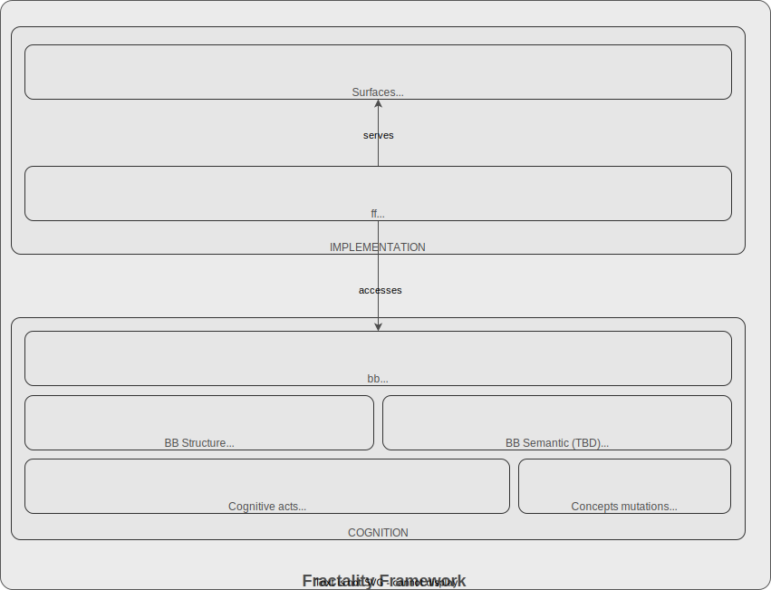

# ff-utility v0.0.1

*Cli utility, the only Fractality Framework part which accesses Bounded Beliefs directly*



## Usage

### Check installation

```bash
ff
# Fractality Framework v0.0.1
# Try ff -h to get help on commands
```
If  it happened you see error message there are two possible causes:
* ff is not installed
* venv is not activated

Solution: see [Managing intallation](docs/ff-utility_installation.md)

### bb initialisation

Every bb lives in file system's directory and should be initialized first.

```bash
ff init
```

- If the directory is not under git, you will be asked whether to initialize a git repository. Answering `n` exits without creating anything.
- If a BB store already exists, prints its title and description and exits.
- Otherwise, prompts for a title and description (both optional — press Enter to skip), then creates the store.

The BB store is kept entirely inside `.git/` and does not add any files to your working tree.


### Query concepts by words

```bash
ff ?"<string>" | <file.md> <options>

# <similarity rate>  <alias> <uuid> <title>
# <content>

# <similarity rate>  <alias> <uuid> <title>
# <content>

```
Returns existing concepts from BB ranked by semantic similarity to the input:
* similarity rate -- how close concept suggested from BB to queried one by semantic
* alias -- auto-generated temporary variable name to address concept during this session
* uuid -- full uuid of concept suggested
* title -- derived from first highest level heading of markdown text describing concept
* content -- concept description exepting title

**Options are to modify output:**
* no options defaults -- as shown in code above, content is truncated
* --full -- as shown in code above, full content
* --json -- output structured as json, content is truncated
* --full --json -- output structured as json, full content
* --markdown -- output writes one md-file per concept into working tree, full content

### Recording concepts

#### Genesis

```bash
ff "<string>" | <file.md> --genesis
```
Records title and content as a brand new concept in BB, assigns a UUID.

#### New version

```bash
ff "<string>" | <file.md> --uuid <uuid> | --alias <alias>
# uuid -- first 4 digits at minimum
```

Records title and content as a new version of an existing concept. Version history is kept in git

### Lookup concept by uuid or alias

```bash
ff --uuid <uuid> | --alias <alias> [options]
```

Returns the latest version of a concept from BB.

**Aliases**

Suggest assigns short aliases (`a`, `b`, `c`, ...) to each result and saves them to `.git/bb/aliases.json`. Aliases persist — a concept keeps its alias across sessions. Re-running suggest only adds aliases for new concepts; existing aliases are never overwritten.

To rename an alias:
```bash
ff --alias <current> <new>
```

**Version addressing**

By default `--uuid` and `--alias` return the latest version. Append `@` to address a specific version or range:

```bash
ff --uuid <uuid>@3          # exact version 3
ff --uuid <uuid>@2+         # versions 2 to latest, oldest first
ff --uuid <uuid>@2-         # versions 2 to genesis, newest first
ff --alias a@2              # same syntax works with aliases
```


